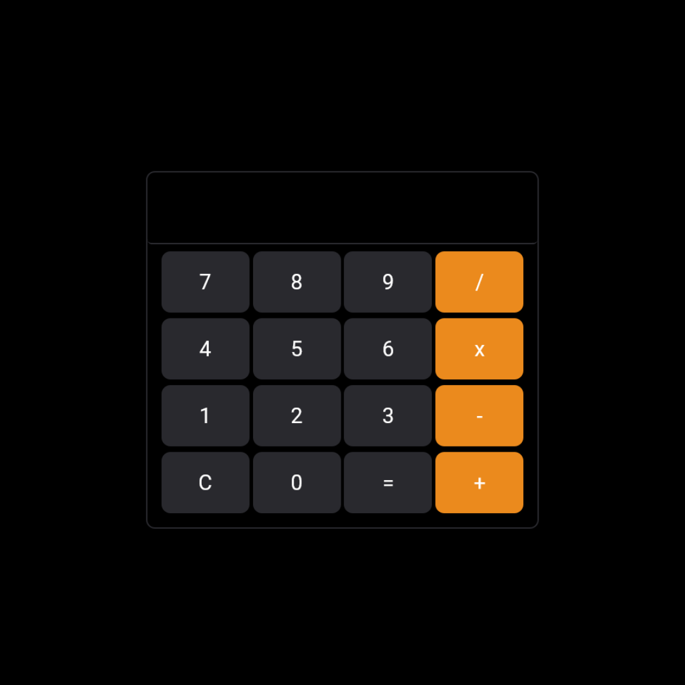

# Calc.Js

Projeto de uma simples calculadora desenvolvida com javascript

## 🛠️ Stack utilizada

- HTML
- CSS
- JAVASCRIPT

## ⬆️ Melhorias

- Adicionar operações mais complexas
- Implementar uma melhor formatação dos números na tela
